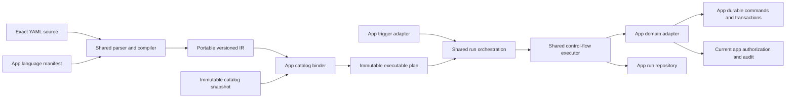

# Shared workflow kernel design

The shared workflow kernel provides one concentrated language and runtime for Grids and Mail while defining the extension boundary for Assistant and later Cloud apps.

Status: The Grids and Mail migrations are implemented for their current deterministic vocabularies. The shared current APIs are the language and binding contracts, pure built-ins, deterministic executor, coordinator, schedule reconciliation, explicit run-wake contract, lifecycle helpers, and conformance fixtures. Apps implement durable waiting transitions and batch materialization through their own PostgreSQL persistence. The cross-app author SDK, external-effect action packs, broader Mail vocabulary, and Assistant integration remain target design. Last updated: 2026-07-16. Both workflow surfaces are local alpha and were replaced directly without compatibility readers or parallel runtimes.

## Contents

- [Decision summary](#decision-summary)
- [Product acceptance rule](#product-acceptance-rule)
- [Goals and non-goals](#goals-and-non-goals)
- [Current baseline](#current-baseline)
- [Consumer fit](#consumer-fit)
- [Usage stories](#usage-stories)
- [Canonical workflow language](#canonical-workflow-language)
- [Kernel layers](#kernel-layers)
- [Kernel and adapter boundary](#kernel-and-adapter-boundary)
- [Shared action packs](#shared-action-packs)
- [Action and trigger author SDK](#action-and-trigger-author-sdk)
- [Reusable workflow building blocks](#reusable-workflow-building-blocks)
- [Mail adapter requirements](#mail-adapter-requirements)
- [Persistence and lifecycle](#persistence-and-lifecycle)
- [Execution safety and horizontal scaling](#execution-safety-and-horizontal-scaling)
- [Editor and developer experience](#editor-and-developer-experience)
- [Extraction plan](#extraction-plan)
- [Verification gates](#verification-gates)
- [Questions for cross-app review](#questions-for-the-cross-app-review)

## Decision summary

1. **Grids informs the language semantics without constraining them.** The canonical top-level structure is `inputs`, optional automatic `triggers`, and `steps`. The existing implementation contributes proven concepts and product workflows, but no current Grids YAML, database row, API shape, or runtime path is a compatibility contract.
2. **One grammar, app-specific vocabulary.** Consumers share parsing, expressions, control flow, diagnostics, execution semantics, and editor contracts. Each app registers its own resource types, triggers, conditions, and actions.
3. **Mail uses the canonical YAML language.** Mail accepts the same top-level `inputs`, optional automatic `triggers`, and `steps` shape as Grids, with Mail-specific descriptors and bindings. Metadata, activation, immutable version IDs, and effect budgets stay outside YAML.
4. **Extraction is language-first, but the target is one complete runtime contract.** The implemented kernel provides a versioned language manifest, compiler IR, catalog binder, diagnostics, deterministic executor, dry-run traversal, dependency outcomes, coordination, schedule reconciliation, and wake contracts. Grids and Mail use those shared paths with app-owned durable persistence and domain ports; neither keeps a parallel evaluator.
5. **Persistence remains app-owned.** Grids may replace its alpha workflow and run schema directly. Mail keeps immutable versions, target runs, command journal integration, and mailbox-scoped indexes. The kernel consumes repository ports instead of introducing generic workflow tables.
6. **Existing primitives are reused before new syntax is added.** `if` is the common "only run when" construct. `triggers.schedule` starts scheduled workflows. A shared temporal condition may be added for work-hour checks. A generic delayed-action primitive is deferred until a second app needs the same durable behavior.
7. **Side-effect hardening is an extraction gate.** Existing Grids actions reveal the required effects, but their current retry behavior is not frozen. Every action must be deliberately classified and implemented with a production-safe transactional, durable-command, or fail-after-unknown contract before the shared runtime executes it.
8. **One kernel is not one global workflow service.** The shared package provides language and execution mechanics. Workflow ownership, APIs, UI, tables, permissions, retention, and product lifecycle stay in the consuming app.
9. **Agent execution remains a separate runtime.** Assistant may register actions that start or await an AI run, but the workflow kernel does not absorb conversations, model loops, streaming, steering, approvals, memory, or AI usage accounting.
10. **Event transport remains a separate platform primitive.** The kernel consumes a materialized, idempotent trigger delivery. Transactional outboxes, Cloud event envelopes, subscriptions, and consumer groups are designed and operated independently.
11. **Mail safety is an adapter requirement.** Immutable versions, preflight hashes, frozen target sets, source preconditions, effect budgets, command reconciliation, and `needs_attention` are app-owned contracts that the shared executor must preserve.
12. **The alpha migrations are clean cuts.** Grids and Mail replaced their earlier source, rows, and runtime paths directly. Neither app has a compatibility reader, converter, or dual executor.
13. **Direct invocation is universal.** Every workflow can be invoked through an authorized UI, API, CLI, dashboard, scanner, bulk-selection, or agent surface. Those are invocation channels, not YAML triggers. Omitting `triggers` creates a direct-only workflow.
14. **Dry-run is a first-class run mode.** It uses the same source, binding, inputs, permissions, conditions, and step traversal without committing domain effects. Unsupported simulation is explicit and may make dependent steps indeterminate; the kernel never silently pretends a skipped action succeeded.

## Product acceptance rule

Every workflow capability, trigger, launcher, action, and migration decision must pass two gates.

### 1. The process can be represented and executed

The model must express the real operation without hidden manual steps or app-specific runtime exceptions. Required inputs, bindings, conditions, permissions, effects, waiting, retries, cancellation, idempotency, revision behavior, and audit must have explicit contracts. A workflow is not complete merely because its happy path can be demonstrated.

### 2. The user understands what happens and why

The product surface must explain the operation at the point where the information matters:

- before starting: which workflow and revision will run, which records or resources are affected, which inputs are required, and why the action is available or unavailable;
- while running: current state, progress, waiting, and the specific item or step being processed;
- after running: concrete outcomes, domain-specific success or failure messages, partial results, retry options, and access to run details or audit history;
- while configuring: how an automatic trigger or launcher supplies each workflow input, with immediate diagnostics for missing, incompatible, inaccessible, or stale bindings.

The UI must not require users to understand the distinction between kernel, adapter, trigger, launcher, or revision to complete their task. Those concepts may appear in administrative reference material, but operational screens use the user's domain language. A technically generic mechanism is rejected if it makes a proven app workflow harder to understand or operate.

## Goals and non-goals

### Goals

- Give users one recognizable YAML workflow language across Cloud apps.
- Preserve required Grids product processes and understandable UX while freely replacing the alpha workflow implementation and syntax.
- Reuse the difficult parts once: strict YAML parsing, diagnostics, expressions, control flow, run claims, leases, fencing, recovery, step restoration, schedules, and editor intelligence.
- Let apps expose strongly typed domain capabilities without coupling the kernel to Grids records or Mail messages.
- Let Assistant orchestrate deterministic work around durable agent runs without turning the AI runtime into a workflow step executor.
- Support hundreds of mailboxes and workflows without process-local authority, global workflow scans, or one queue payload per message body.
- Make deterministic rules the baseline and leave a clean extension point for later AI decisions.
- Keep app permissions and current-resource access authoritative at execution time.

### Non-goals

- A cross-app workflow that moves data between arbitrary Cloud apps.
- Replacing the Cloud operation/event capability catalogs or making workflow descriptors the universal app API.
- Replacing the durable AI turn runtime with workflow runs or steps.
- Owning a global workflow UI, permission model, or workflow database in Cloud core.
- A universal low-code platform or visual workflow builder.
- One shared workflow database schema.
- Forcing Grids and Mail to use the same authoring/version lifecycle.
- Making every app action available in every other app.
- Introducing delayed actions, approvals, calendars, or AI nodes before a concrete workflow requires them.
- Rewriting unrelated stable Grids domain logic merely to make it look generic.

## Current baseline

### Grids uses the shared kernel

Grids now compiles and executes workflows through the shared Cloud workflow package:

- `packages/cloud/src/workflows/contracts.ts` defines the shared manifest, IR, bound plan, invocation, receipt, diagnostics, and run contracts.
- `packages/cloud/src/workflows/language/` owns strict YAML parsing, expressions, control flow, source locations, and manifest-driven compilation.
- `packages/cloud/src/workflows/runtime/` owns deterministic execution, dry-run traversal, step restoration, lease heartbeats, and action ports.
- `packages/grids/src/workflows/manifest.ts` registers the Grids input, automatic-trigger, and action vocabulary once. The binder and editor consume the same descriptors.
- `packages/grids/src/workflows/binder.ts` resolves visible table, field, document-template, and email-template references to stable IDs.
- `packages/grids/src/service/workflow-kernel-runtime.ts` adapts durable Grids runs, permissions, schedules, record events, tracing, and recovery to the shared runtime.
- `packages/grids/src/service/workflow-kernel-actions.ts` implements Grids domain actions with explicit transactional, durable-intent, or ambiguous-external effect handling.
- `packages/grids/src/service/workflow-kernel-launchers.ts` invokes direct workflows from scanner, bulk-selection, and dashboard surfaces. These launchers are invocation channels rather than YAML triggers.

Grids YAML has only three top-level concepts: typed `inputs`, optional automatic `triggers`, and recursive `steps`. Omitting `triggers` creates a direct-only workflow that remains available to authorized UI, API, CLI, dashboard, scanner, bulk, and agent callers. Built-in automatic triggers are `schedule` and `recordEvent`.

The alpha migration removes the former Grids workflow grammar, executor, trigger runtime, and data tables. Generated document records survive that reset, but references to removed workflow runs are cleared because the referenced audit record no longer exists. Grids does not carry a legacy parser, converter, or dual execution path.

### Mail uses the shared language and executor

Mail now compiles and executes workflows through the shared Cloud workflow package while retaining its domain safety and persistence:

- `packages/mail/src/workflows/manifest.ts` declares `mailMessage` and `mailConversation`, `messageReceived` and `schedule`, and the current Mail action vocabulary.
- `packages/mail/src/workflows/binder.ts` validates typed references and binds accessible folders and assignable users to stable catalog IDs.
- `packages/mail/src/service/workflow-definition-service.ts` owns metadata, exact YAML source, immutable versions, activation registrations, authorization snapshots, and compiler/catalog identities.
- `packages/mail/src/service/workflow-preflight-service.ts` uses shared dry-run traversal to freeze target snapshots, count effects, enforce budgets, and produce an execution commitment hash.
- `packages/mail/src/service/workflow-runtime.ts` and its repository/action/value adapters use the shared executor, coordinator, waiting protocol, step restoration, leases, and execution-generation fencing.
- `packages/mail/src/service/workflow-trigger-runtime.ts` dispatches deduplicated live `messageReceived` events, and `workflow-schedule-runtime.ts` reconciles revision-fenced due-slot registrations.

Mail exposes both stateless preflight commitments and durable dry-run records. Dry-run action planners receive no effect-capable ports.

## Consumer fit

### Grids

Grids remains the first adapter and process suite. It contributes record inputs, scanner and record-event workflows, table and field references, document and email templates, record mutations, document generation, HTTP requests, and its access model. Tests capture the required processes and UX outcomes against the new contracts; they do not preserve old workflow source or storage.

### Mail

Mail needs the common grammar and executor but retains immutable workflow versions, mailbox-local target discovery, effect budgets, hydration, provider command reconciliation, collaboration revisions, and guarded automatic replies. Its durable command journal is an app adapter behind the kernel's waiting/effect contracts, not a second generic command system.

### Assistant and agents

Assistant is a consumer at the orchestration boundary, not evidence that AI internals belong in the kernel. Useful adapter capabilities include typed agent/project inputs, manual or scheduled triggers, `runAgent`, and possibly `awaitAgentRun`. Those actions create or observe durable AI runs through the existing AI service. An approval or long-running agent turn suspends the workflow through an opaque dependency token and resumes it when the AI runtime emits a durable completion signal.

The workflow snapshot stores stable agent/configuration references and the effective invocation policy needed for audit. The AI runtime remains authoritative for model execution, conversation state, tools, approvals, streaming, steering, token usage, and its own leases.

An agent action contract therefore needs:

- stable agent/project identity plus the effective configuration revision;
- the invoking principal and current permission recheck;
- typed input and an optional structured-output schema;
- explicit time, cost, and output-size budgets;
- a durable child-run ID, terminal completion signal, and trace correlation;
- declared cancellation ownership so parent cancellation never silently abandons or kills unrelated work.

### Future apps

A future app should be able to adopt the kernel without importing Grids or Mail. Adoption requires an app registry, app-owned repositories, trigger adapters, current authorization checks, and action handlers. No app-specific union may be added to Cloud core merely because one built-in app needs it.

## Usage stories

The design is evaluated against concrete workflows rather than abstract extensibility.

| Story | Shared mechanics | App-owned behavior |
| --- | --- | --- |
| A Grids record event updates a related record | language IR, stable step identity, deterministic control flow | event outbox, GQL, record permissions, mutation transaction |
| A user runs one workflow over 8,000 selected records | child keys, cursors, progress, pause/resume, budget accounting | target discovery, frozen record IDs, per-record authorization |
| A cron workflow starts in a configured timezone | normalized schedule, deterministic slot key, DST and misfire policy, reconciliation | activation policy and execution principal |
| Mail classifies and moves an inbound message | typed conditions, waiting result, control flow | message hydration, folder resolution, provider command and Mail policy |
| A Mail backfill changes thousands of messages | batch coordination, target idempotency, restart recovery | preflight hash, query cursor, frozen targets, effect budgets, provider preconditions |
| A workflow starts an AI agent and consumes structured output | typed action output, durable child dependency, schema validation | agent grants, tools, prompt, model, cost and time budgets |
| A destructive action waits for human approval | persisted dependency, timeout, cancellation, deduplicated wakeup | approver policy, approval UI and audit details |
| An HTTP request crashes after the remote service may have accepted it | explicit ambiguous outcome and no blind retry | URL policy, credentials, reconciliation capability |
| Document rendering completes asynchronously | durable intent, completion wakeup, restored output | template, snapshot, document permissions and storage |

These stories establish three boundaries:

- `forEach` is for bounded in-memory values. Large record or message sets use a durable batch coordinator.
- AI execution is a child runtime. The workflow stores the child run identity and waits for a durable completion signal; it does not execute the model/tool loop.
- Preview and planning are app policies over a shared side-effect-free planning contract. They are not mandatory YAML syntax.

## Canonical workflow language

### Compatibility rules

The following rules are hard constraints for the extraction:

- Existing Grids action, condition, and expression semantics remain stable.
- Both alpha consumers use the canonical source directly; the language does not retain obsolete invocation-trigger aliases.
- Unknown keys remain validation errors. Extensibility comes from an app's explicit registry, not permissive schemas.
- `name`, `description`, ordering, activation state, and revision/version metadata remain outside YAML.
- `triggers` is optional. If present, it contains one or more automatic event subscriptions. An empty `triggers: {}` is invalid so omission remains the one obvious direct-only form.
- Compilation is deterministic for a given source and language manifest. Canonical manifest and catalog hashing uses locale-independent key ordering. The IR stores the compile-time manifest hash, and binding rejects the same language ID/version when that hash differs. Catalog binding is a separate deterministic phase for a given IR and app catalog snapshot.
- Mail requirements do not rename or reinterpret retained Grids syntax.

### Common grammar

The canonical grammar remains:

```yaml
inputs:
  item:
    type: text
    required: true

steps:
  - if:
      exists: inputs.item
    then:
      - setVariable:
          name: result
          value: ${{ inputs.item }}
      - succeed:
          message: Processed ${{ result }}
```

This workflow is direct-only because it has no `triggers` key. The kernel owns the shape and behavior of `inputs`, automatic `triggers`, `steps`, expressions, scopes, and common control flow. Registries contribute the strict schemas and runtime behavior available inside those slots.

### Registry composition

"One language" does not mean one global union containing every Cloud action. A workflow is compiled for exactly one app adapter. Grids can expose record and document actions while Mail exposes message and collaboration actions, but both use the same grammar and editor protocol.

Conceptually, an app defines its language as follows:

```ts
const mailWorkflowLanguage = defineWorkflowLanguage({
  id: "mail",
  inputs: {
    ...commonInputs,
    mailMessage: mailMessageInput,
    mailConversation: mailConversationInput,
  },
  triggers: {
    ...commonTriggers,
    messageReceived: mailMessageReceivedTrigger,
  },
  conditions: {
    ...gridsCompatibleConditions,
    contains: containsCondition,
    all: allCondition,
    any: anyCondition,
    not: notCondition,
    inTimeWindow: inTimeWindowCondition,
  },
  actions: {
    ...commonActions,
    addKeyword: mailAddKeywordAction,
    moveMessage: mailMoveMessageAction,
    assignConversation: mailAssignConversationAction,
  },
});
```

This is an API direction, not a frozen TypeScript signature. The Grids review should validate the smallest registry shape that can be extracted from the existing code without duplicating schema, validator, runtime, and editor metadata.

### Current Mail source

Mail authoring uses the common grammar with Mail-specific vocabulary:

```yaml
inputs:
  message:
    type: mailMessage
    required: true
  conversation:
    type: mailConversation
    required: true

triggers:
  messageReceived:
    with:
      message: "${{ trigger.message }}"
      conversation: "${{ trigger.conversation }}"

steps:
  - if:
      all:
        - contains:
            - ${{ inputs.message.subject }}
            - invoice
        - not:
            contains:
              - ${{ inputs.message.sender.email }}
              - example.invalid
    then:
      - addKeyword:
          message: "${{ inputs.message }}"
          keyword: Finance
      - moveMessage:
          message: "${{ inputs.message }}"
          folder: Invoices
```

The `all`, `not`, `contains`, `mailMessage`, and Mail action names above are implemented vocabulary. Required trigger inputs use explicit `with` bindings from typed trigger values.

Human-readable catalog references in source must compile to stable app-owned identities or be frozen in the run snapshot. A folder or table display name must never be the runtime authority after it is renamed or becomes ambiguous.

## Kernel layers

The kernel should expose separate layers so an app can adopt the language without replacing its proven runtime. Compilation and app catalog binding are deliberately separate:

```text
YAML source + language manifest
            |
            v
  1. Language compiler
     parse -> strict schema -> semantic validation -> portable versioned IR
            |
            v
  2. App catalog binder
     IR + catalog snapshot -> stable resource IDs -> immutable executable plan
            |
            v
  3. Shared deterministic executor
     values -> conditions -> control flow -> action outcomes
            |
            v
  4. Shared durable run coordinator
     claim -> lease/fence -> step restore -> wait/resume -> finish
            |
            v
  5. App integration
     triggers, permissions, actions, audit, UI, repositories
```

Layers 1 and 2 own no workflow database, queue, scheduler, or provider service. Binding may read an app catalog snapshot through a narrow port, but only the bound plan contains stable IDs. Layers 3 and 4 are the single execution path for every migrated app. Grids was the first complete runtime consumer; Mail is the second. The final app-integration layer is always app-owned. The event bus and AI turn runtime sit beside these layers, not inside them.

The recommended home remains `@valentinkolb/cloud/workflows` with explicit, non-overlapping exports:

```text
@valentinkolb/cloud/workflows           neutral contracts and factories
@valentinkolb/cloud/workflows/language  parser, compiler, binder, IR, diagnostics
@valentinkolb/cloud/workflows/runtime   server-only executor and runtime ports
@valentinkolb/cloud/workflows/testing   Bun-only conformance harnesses and fakes
@valentinkolb/cloud/workflows/ui        browser-safe source editor integration
```

The root export must not re-export runtime, testing, or UI code. Language and UI entry points must remain browser-buildable; runtime is server-only and testing is Bun-only. If dependency or bundle analysis shows that adding the YAML parser to `@valentinkolb/cloud` materially harms unrelated consumers, use a private workspace package with the same contracts rather than weakening the boundary. No external dependency version is changed as part of extraction without a separate decision.

### Invocation channels and automatic triggers

Every workflow has one direct invocation contract generated from `inputs`. UI forms, API calls, CLI commands, dashboard buttons, scanners, bulk selections, and agents all call that contract. The app adapter authorizes the caller and maps the channel payload to the declared inputs before the kernel materializes a run.

`triggers` declares only automatic subscriptions such as `schedule`, Grids `recordEvent`, or Mail `messageReceived`. Each trigger binds event values or explicit constants to declared inputs through `with`. Activation fails if a required input is unbound, has the wrong type, references an unavailable resource, or cannot be resolved under the workflow owner policy.

```yaml
inputs:
  reportDate:
    type: dateTime

triggers:
  schedule:
    cron: "0 8 * * *"
    timezone: Europe/Berlin
    with:
      reportDate: ${{ trigger.occurredAt }}
```

Steps consume `inputs` rather than requiring trigger-specific event objects, so a scheduled or event-driven workflow remains manually runnable with equivalent inputs.

The clean-cut migration removes Grids `form`, `api`, `dashboardButton`, `scanner`, and `bulkSelection` from `triggers`:

- form, API, CLI, dashboard, and agent execution are universal invocation channels;
- scanner and bulk selection are app interaction modes that collect declared inputs;
- schedule and domain events remain YAML triggers because they autonomously create runs.

Invocation-specific configuration is stored as an app-owned launcher, not hidden in the workflow source:

```ts
type WorkflowLauncher = {
  workflowId: string;
  channel: "form" | "dashboard" | "scanner" | "bulk";
  inputBindings: Record<string, LauncherBinding>;
  presentation: LauncherPresentation;
  permissionPolicy: LauncherPermissionPolicy;
};
```

A scanner launcher contains its scan-code or field-resolution rule; a bulk launcher selects the target `recordList` input; a dashboard launcher owns label, placement, and presentation. Launchers follow the active revision and are revalidated whenever its input contract changes. An invalid launcher is disabled with a diagnostic rather than invoking a workflow with guessed inputs.

### Grids scanner product requirement

Moving scanner configuration out of `triggers` is a language cleanup, not a reduction of the Grids scanner product. The migrated scanner must preserve these UX and behavior contracts:

- one stable opaque scan code identifies a record independently of a workflow; a configured unique field remains an explicit alternative resolver;
- record lookup, uniqueness checks, permissions, and workflow input binding happen on the server;
- dashboard and workflow surfaces open the same mobile-first scanner session, with the existing desktop-modal and dedicated mobile-page presentation remaining Grids-owned;
- the camera stays available while scans are processed, with bounded backpressure rather than blocking the capture surface on one run;
- every accepted scan creates one idempotent workflow invocation and one visible session-log entry with resolving, running, succeeded, failed, or rejected state;
- repeated camera detections are suppressed without hiding an intentional later rescan, and backend idempotency remains authoritative;
- workflow `succeed` and `fail` messages are displayed for the corresponding scanned item so operators receive domain-specific feedback such as "already returned";
- selecting a log entry opens its run details and audit trail; failed entries can be retried explicitly when the workflow contract permits it;
- opening a session captures the launcher and active workflow revision. Each scan supplies that expected revision; if activation changes, scanning pauses with a clear restart prompt instead of mixing workflow revisions in one session.

The scanner session is app-owned orchestration over the common invocation API. It groups run IDs and presentation state but does not become a second executor. Labels remain record labels: the same item code can be used by return, checkout, inventory, or maintenance workflows without generating a workflow-specific label.

A Mail backfill is a durable batch invocation mode. It resolves a bounded target query and invokes the same executable plan for each frozen target. Target discovery, materialization cursors, progress, effect budgets, preflight hashes, cancellation, and resumability remain Mail-owned persistence because those semantics depend on Mail's target model.

Every invocation has one explicit contract. Automatic trigger adapters may record additional audit context, but workflow logic should receive required domain values through `inputs` so direct invocation never needs to fabricate an event:

```ts
type WorkflowInvocation = {
  workflowId: string;
  expectedRevisionId?: string;
  mode: "execute" | "dryRun";
  channel: "ui" | "api" | "cli" | "dashboard" | "scanner" | "bulk" | "agent" | "schedule" | "event";
  idempotencyKey: string;
  occurredAt: string;
  actor: WorkflowActor;
  inputs: Record<string, unknown>;
};
```

Conceptually, all channels converge on one API:

```ts
await workflows.invoke({
  workflowId,
  expectedRevisionId,
  mode: "execute", // or "dryRun"
  actor,
  inputs,
  channel: "ui", // api, cli, dashboard, scanner, bulk, agent, schedule, event
  idempotencyKey,
  occurredAt,
});
```

The app adapter atomically pins the active revision while materializing the run. `expectedRevisionId` lets UI and API callers reject an invocation if activation changed after the user reviewed it. The idempotency domain always separates app, workflow, mode, and caller key. An adapter may additionally partition by channel only when that channel comes from trusted server routing; client-supplied provenance must not create a second effect domain. The request fingerprint includes the pinned revision, actor, normalized inputs, and trusted invocation metadata. Reusing a key with a different fingerprint is a conflict rather than a second run. Dry-run and execution therefore never collide, while a retry cannot create a second run merely because activation changed. Automatic triggers derive deterministic keys; UI and API clients receive or provide request keys.

Normal execution requires an active workflow and app authorization. Deactivation prevents new runs but does not silently cancel already materialized runs. Editors may validate or dry-run an unsaved or inactive draft through a separate endpoint, but a draft cannot create an effectful run.

## Kernel and adapter boundary



### The language kernel owns first

- strict YAML parsing, exact-source hashing, and source diagnostics;
- registry composition into a strict definition schema;
- structural and registry-provided semantic validation;
- a portable, versioned IR with source locations;
- deterministic binding of human-readable references to stable app-owned IDs;
- expressions, scopes, variables, and output restoration;
- `if`, `switch`, `forEach`, `setVariable`, `succeed`, and `fail`;
- deterministic step paths, loop bounds, and execution limits;
- whole-program analyzer hooks for cross-step constraints such as conflicting Mail mutations or actions that must run last;
- common execution events and diagnostics;
- a registry-driven completion/reference model for YAML editors.

### The shared durable runtime owns

- deterministic control-flow traversal against the bound plan;
- run claim, lease, heartbeat, fencing, cancellation, and recovery protocols through a repository port;
- step lifecycle and the rules for restoring completed work after restart;
- trigger idempotency keys and generic schedule registration through scheduler ports;
- a waiting outcome and repository port for atomically parking the current step;
- an explicit, best-effort run-wake contract whose transport payload contains only the run ID;
- reusable schedule normalization, stable registration and slot identities, and reconciliation planning.

The kernel's execution outcome must be able to represent more than a boolean result:

```ts
type StepOutcome<T> =
  | { state: "completed"; output?: T }
  | { state: "waiting"; dependency: WorkflowDependency }
  | { state: "failed"; error: WorkflowExecutionError }
  | { state: "needs_attention"; reason: WorkflowExecutionError }
  | { state: "terminal"; status: "succeeded" | "canceled"; message?: string };
```

`WorkflowDependency` is opaque to the kernel except for stable identity and resume semantics. Mail commands, AI runs, approvals, and later durable external operations can therefore wait without teaching the kernel their domain. Wakeup delivery is a best-effort latency hint and may be duplicated or lost. Correctness comes from PostgreSQL recovery, duplicate suppression, and a fenced atomic state transition.

### An app adapter owns

- resource permissions and current-access rechecks;
- the app's workflow metadata and activation policy;
- domain input resolution and immutable resource/catalog snapshots;
- trigger event ingestion and app-specific trigger filtering;
- domain references and value projection;
- action planning and execution;
- durable command creation, reconciliation, and provider interaction;
- audit details, actor representation, and sensitive-value redaction;
- bulk target discovery and target snapshot policy;
- app-specific execution commitments such as Mail preflight hashes, effect budgets, resource preconditions, and approvals;
- app tables, migrations, retention, and public API shapes;
- mapping common run outcomes to app-specific lifecycle states and user-facing activity.

### Minimal extension contracts

The extraction should prefer a few cohesive descriptors over a large service interface.

An action descriptor needs enough information for validation, intelligence, planning, execution, and recovery:

```ts
type WorkflowActionDescriptor<TConfig, TOutput = void> = {
  schema: ZodType<TConfig>;
  output?: WorkflowValueKind;
  effect: "pure" | "transactional" | "durable-command" | "external-fail-after-unknown";
  validate?: (context: ValidationContext, config: TConfig) => WorkflowDiagnostic[];
  plan?: (context: PlanningContext, config: TConfig) => Promise<PlannedEffect[]>;
  execute: (context: ActionContext, config: TConfig) => Promise<ActionResult<TOutput>>;
  serializeOutput?: (output: TOutput) => unknown;
  restoreOutput?: (stored: unknown) => TOutput;
  intelligence?: WorkflowIntelligenceDescriptor;
};
```

The final API may split this descriptor, but it must preserve four distinctions:

1. pure evaluation can be repeated;
2. transactional changes are idempotent under the app database transaction and step key;
3. external effects go through a durable command or an equally strong idempotency and reconciliation contract.
4. explicitly classified fail-after-unknown effects are never retried after an interrupted execution.

The shared executor must never infer that an arbitrary `execute()` call is retry-safe. Existing Grids effects that do not yet satisfy one of these contracts retain their current fail-after-unknown behavior until hardened.

The descriptor registry must also drive strict schema composition, semantic validation, output typing, documentation, and editor intelligence. A trigger or action must not be added by editing five independent switch statements. Runtime handlers may be supplied separately from language descriptors so browser/editor code never imports database or provider code. The registry also supports app-level whole-program analyzers; per-action validation alone cannot express Mail invariants such as move-last, conflicting assignments, or provider actions after collaboration changes.

`forEach` must use a generic bounded iterable contract. Grids `recordList` remains one iterable value kind, while future adapters may declare other snapshot-safe list values. Iteration order and item serialization are part of the executable contract; unbounded database or mailbox scans remain app-owned batching modes rather than in-memory workflow lists.

## Shared action packs

The registry model must prevent apps from reimplementing utility behavior. Shared actions are grouped by ownership and dependency level rather than placed in one growing global union.

### Kernel built-ins

Every language includes these implementations directly from the kernel:

- `setVariable`;
- `if`, `switch`, and bounded `forEach`;
- `succeed` and `fail`;
- common value expressions and functions;
- recursive conditions `equals`, `notEquals`, `exists`, `contains`, `startsWith`, `endsWith`, `all`, `any`, and `not`.

These actions are deterministic and have no app or network dependencies. Apps may configure limits, but they must not replace their semantics.

### Optional platform action packs

Cloud may later provide reusable descriptors and hardened executors that an app explicitly enables:

- `httpRequest`, including URL policy, timeouts, JSON limits, redaction, tracing, and fail-after-unknown behavior;
- Cloud notification delivery;
- email delivery through a narrow template/render/delivery port;
- durable delay or wait primitives if a second real consumer proves common semantics;
- operation invocation once the Cloud operation catalog contract is stable.

An action pack owns schema, validation, diagnostics, autocomplete/reference metadata, output codec, effect classification, runtime implementation, and conformance tests. App configuration supplies policy and narrow service ports, not a copied executor. For example, Grids may resolve a Grids email-template ID while another app resolves its own template entity, but recipient validation, rendering result limits, delivery outcome, audit metadata shape, and retry contract can share lower-level utilities even when the final actions remain app-owned.

Platform action packs are opt-in. Enabling the workflow kernel must not automatically grant network, email, notification, or cross-app capabilities. The first extraction shares only pure built-ins. HTTP, email, and notification packs are promoted only after at least two app actions prove behavioral identity; before that they share hardened low-level utilities without a misleading common action.

### App domain actions

Actions remain app-owned when their semantics depend on an app's data model or permission boundary. Examples include Grids `updateRecord` and `generateDocument`, Mail `moveMessage` and guarded automatic replies, and Assistant `runAgent`. They use the same descriptor and effect contracts but live in their app adapter.

The test for sharing is behavioral identity, not similar naming. Two actions should share an implementation only when validation, authorization boundary, side-effect semantics, retry behavior, output contract, and audit expectations are the same. Otherwise they may share lower-level helpers without pretending to be one action.

### Composition API

An app assembles one explicit language instead of importing a global action set:

```ts
const gridsWorkflowLanguage = defineWorkflowLanguage({
  id: "grids",
  builtins: workflowBuiltins,
  packs: [httpWorkflowActions, notificationWorkflowActions],
  inputs: gridsInputs,
  triggers: gridsTriggers,
  actions: gridsActions,
});
```

Composition rejects duplicate names and incompatible descriptor versions. The resulting registry has a deterministic digest stored with compiled workflows and run snapshots.

## Action and trigger author SDK

The factory APIs in this section are proposed. Current Grids and Mail adapters use the implemented shared descriptors, pure built-ins, and runtime ports without exposing these authoring factories as a public SDK.

Shared implementations are needed at two levels: ready-to-enable action packs for users and lower-level helpers for developers who add app actions. The author SDK should make the reliable path the shortest path without hiding authority or side effects.

### Action factories

Provide constrained factories instead of one permissive `execute` callback:

```ts
definePureAction({ ... })
defineSameTransactionAction({ ... })
defineDurableIntentAction({ ... })
defineAmbiguousExternalAction({ ... })
```

Each factory fixes the allowed lifecycle and requires the corresponding hooks. A durable-intent action must provide intent identity, status lookup, reconciliation, output restoration, and cancellation behavior. An ambiguous-external action receives no automatic retry path. This prevents an action author from accidentally labelling an arbitrary network call as retry-safe.

### Dry-run contract

Dry-run is a separate planning path, not `execute({ dryRun: true })`. Its `PlanningContext` exposes catalog reads, authorization checks, snapshots, budgets, redaction, and virtual state, but no mutation, mail, HTTP, number-allocation, durable-command, document-link, or AI-run ports. Keeping both the function and its capabilities separate makes accidental side effects structurally harder:

```ts
defineSameTransactionAction({
  schema,
  execute,
  plan: async (context, config) => ({
    state: "would_execute",
    effects: [{ kind: "record.update", before, after }],
    output: predictedOutput,
  }),
});
```

An action descriptor declares one simulation level:

- **full:** `plan` predicts effects and a typed output, so dependent steps can continue;
- **validate:** permissions, references, and configuration are checked, but output/effects are incomplete;
- **unsupported:** no trustworthy simulation exists.

```ts
type PlannedValue<T> =
  | { state: "known"; value: T }
  | { state: "unknown"; reason: string };

type ActionPlan<T> = {
  support: "full" | "validate" | "unsupported";
  effects: PlannedEffect[];
  output: PlannedValue<T>;
  overlay?: VirtualStatePatch[];
};
```

The runtime reports unsupported and indeterminate analysis gaps as an ordered `issues` list. An unsupported action is not executed, but independent later steps are still planned; a later step that needs unavailable state becomes another indeterminate issue rather than receiving an invented value. The top-level result remains `unsupported` when every gap is unsupported and becomes `indeterminate` when any gap is indeterminate. Completed control-step outcomes persist their nested issues and effects so restoration produces the same analysis without rerunning completed children.

Production built-ins and app actions must support at least `validate` before release. Mutations should normally provide full before/after plans. HTTP, email, document generation, approvals, and AI runs may render or describe their intended request without sending, allocating permanent numbers, creating command intents, or starting child runs.

The current executor restores explicit action outputs and variables rebuilt by action restoration hooks. A future action SDK may add a generic virtual-state overlay so later expressions observe predicted record or message changes. Until then, an app planner that cannot provide a trustworthy output or state projection must mark dependent analysis `indeterminate`.

An unknown condition causes both branches to be statically validated while the runtime choice remains `indeterminate`. An unknown loop source validates the loop body but invents no iterations. A wait action reports `would_wait` without persisting a dependency.

Dry-runs use the current bound plan, real input resolution, current authorization, resource preconditions, whole-program analyzers, and app effect budgets. They create an auditable run record with `mode: "dryRun"`, but never a domain side effect. A dry-run result is advisory: execution rechecks permissions and mutable preconditions.

Mail preflight remains a separate execution-safety contract. Its hash commits a later execution to the reviewed immutable version, frozen target set, source preconditions, and effect budget. A workflow dry-run is advisory and must never be accepted as that commitment token. Mail builds preflight by reusing planners, but execute still requires its app-owned preflight checks.

### Runtime context

Action handlers receive a small shared context with stable run and step identity, the bound plan and invocation, lexical variables, value evaluation and reference resolution, and a heartbeat/cancellation check. The identity includes the execution generation and invocation idempotency key. App action adapters own transaction access, effect-intent identity, redaction, authorization, and bounded domain output validation.

The context never grants permission by itself. App services remain responsible for current authorization checks.

### Waiting and dependencies

Waiting is a first-class runtime protocol, not custom polling inside an action:

```ts
return {
  state: "waiting",
  dependency: { kind: "mail.command", key: commandId },
};
```

The kernel supplies the opaque dependency contract, waiting execution outcome, and atomic `parkStep` repository port. Each app persists wait state, deadlines, duplicate-wakeup suppression, cancellation, and the fenced resume transition under a new execution generation in its own PostgreSQL schema. Wake transports are best-effort hints carrying a run ID; recovery queries remain authoritative when a hint is lost. Mail commands and hydration already use this contract. AI runs, approvals, and document rendering can use it once their app adapters provide the same durable transitions.

### Time and schedules

Current schedule support provides normalization, stable registration and slot keys, and a reconciliation planner. App adapters connect those registrations to `@k2b/sync`, revalidate the current activation before materializing a run, and retain PostgreSQL authority. Grids and Mail use the broker-durable scheduler with the default `latest` misfire policy: after downtime, the latest missed cron slot runs and earlier missed slots are collapsed. Delivered duplicate slots are deduplicated. A future timer dependency may pause an already-running workflow without letting actions create unmanaged cron schedules.

An action must not register its own persistent scheduler entry. Recurring starts belong to triggers; delayed continuation belongs to the dependency protocol. This keeps schedules inspectable and prevents orphaned registrations.

### Batch coordination

Large target sets need durable app orchestration rather than an expanded `forEach`:

- app-owned keyset target discovery and immutable target snapshots;
- deterministic child identity and per-target idempotency keys;
- bounded claims, progress counters, effect-budget reserve/commit, pause, resume, and cancellation;
- partial failure and `needs_attention` without blocking unrelated targets;
- restart recovery without placing full target lists in queue payloads.

The shared executor owns one target's deterministic plan execution. The app owns target discovery, child materialization, progress, budgets, and recovery because these operations are coupled to its schema and permission model. Promote a shared batch utility only after two adapters prove identical persistence and recovery semantics.

### Trigger and event utilities

Trigger adapters should receive helpers for deterministic delivery keys, run materialization, duplicate suppression, actor snapshots, queue submission, failed-delivery recording, and recovery. Event selection and permission checks remain app-owned. The event transport remains outside the workflow kernel.

Schedule reconciliation is a shared module. Waiting uses shared contracts plus app-owned persistence, and batch orchestration remains app-owned. These boundaries keep the executor small and avoid a generic persistence abstraction that neither Grids nor Mail can use without leaking domain policy.

### Conformance harness

The testing module should let an action or trigger adapter prove:

- schema, diagnostics, completion, and documentation consistency;
- retry behavior before intent, after intent, and after an ambiguous external outcome;
- output restoration after worker restart;
- cancellation and permission revocation while waiting;
- duplicate wakeup and duplicate trigger suppression;
- stale worker fencing;
- redaction and trace metadata limits.

These tests are part of the extension contract. A new action with external effects is not considered supported merely because its happy path executes.

Conditions need a small asynchronous result contract so Mail can request missing body or attachment data without blocking a worker:

```ts
type ConditionResult =
  | { state: "ready"; value: boolean }
  | { state: "waiting"; dependency: WorkflowDependency };
```

Grids conditions normally return `ready`. A Mail condition can return `waiting`, persist the hydration dependency, and resume the same run after data arrives. The kernel treats the dependency as opaque.

## Reusable workflow building blocks

| Concern | Shared shape | First extraction |
| --- | --- | --- |
| Only run when | Existing `if`/`then`/`else` | Reuse unchanged; do not add `onlyRunWhen` to every action. |
| Multiple branches | Existing `switch` | Reuse unchanged. |
| Repeated work | Existing `forEach` with bounded loops | Reuse unchanged. Mail should avoid using it for unbounded mailbox scans. |
| Variables and outputs | Expressions, scopes, `saveAs`, and `setVariable` | Use Grids scenarios to test the concentrated contract without preserving old source. |
| Terminal outcomes | Existing `succeed` and `fail` | Reuse unchanged. |
| Start on a schedule | Existing `triggers.schedule` with cron and timezone | Extract scheduler registration and deterministic slot keys. |
| Run only during a time window | Additive `inTimeWindow` condition over an explicit `TemporalWindow` | Candidate for the first Mail extension if Grids accepts the generic contract. |
| Delay future work | A future `defer` control-flow block, not per-action timing flags | Defer until two apps need identical durable semantics. Mail send can retain its existing absolute `scheduledAt` command meanwhile. |
| Boolean conditions | Additive `all`, `any`, and `not` operators | Needed for ergonomic Mail rules; exact syntax requires Grids review. |
| Text comparison | Additive typed operators such as `contains`, `startsWith`, and `endsWith` | Prefer generic operators where semantics are identical; keep provider-specific checks in Mail. |
| Retry and restore | Step paths, stored outputs, effect classification, durable commands | Kernel responsibility with app repository and command ports. |
| Preview | Optional action planning metadata and app-owned budgets | Mail consumes it first; no forced Grids UI change. |
| Dry-run | Shared run mode plus per-action `plan` contract | Required across UI, API, CLI, schedules, and event workflows; unsupported outputs remain explicit. |
| Actor and audit | Opaque execution actor plus app audit hooks | App-owned authorization and attribution. |

### Temporal windows

A temporal window is different from a schedule trigger:

- a schedule trigger decides **when a workflow starts**;
- a temporal condition decides **whether a branch is eligible now**;
- a delayed action decides **when already-planned work may execute**.

Only the first two are required now. A proposed `TemporalWindow` should contain explicit timezone, weekdays, local start/end times, and optional date exclusions. UI presets such as "work hours", "outside work hours", or "holiday" should expand to explicit YAML instead of becoming magic runtime strings. Named shared calendars are out of scope until a concrete product requirement needs them.

The first extraction does not add a Mail-specific `response_schedules` table or a `schedule` option to every action. Mail's existing send command may continue to accept an absolute `scheduledAt` value when an action explicitly creates a scheduled send.

The clock used by temporal conditions must be injected. `${{ now() }}` represents the injected execution clock, while immutable `trigger.occurredAt` provides deterministic event time. No legacy Grids expression behavior constrains this contract.

## Mail adapter requirements

The first deterministic Mail adapter is implemented. The lists below distinguish its current contract from the broader product vocabulary that still needs concrete actions and tests.

### Inputs and values

Mail currently provides typed message and conversation inputs plus mailbox and trigger values. Hydrated body and attachment fields resolve through the app-owned value port. Folder and assignable-user literals bind through the Mail catalog. Authorization snapshots remain runtime authority and are not exposed as workflow source data.

Later vocabulary may add typed references for:

- mailbox;
- message and hydrated message content;
- conversation and collaboration state;
- folder and sender identity;
- workflow actor and trigger facts.

The compiler should understand which properties are available and which require hydration. Runtime values remain app-owned objects; the kernel only handles declared kinds, references, serialization, and scopes.

### Triggers

The current Mail adapter provides:

- `messageReceived`, emitted once for a stable imported provider message;
- direct invocation for UI, API, CLI, and agents;
- backfill as a bounded target execution mode;
- `schedule` source validation and activation registration.

Activation connects those registrations to the shared schedule reconciler. Due slots are revision-fenced and enter the same Mail materialization path as manual and event invocations.

Later triggers may include collaboration state changes. A conversation reopening caused by new inbound mail should normally be part of the `messageReceived` trigger facts rather than a second competing event.

For live mail, trigger dispatch performs one indexed lookup by mailbox and trigger kind. It must not scan workflows from other mailboxes or enqueue whole message bodies.

### Conditions

Current Mail conditions use the shared equality, text, existence, and boolean operators over the implemented message and conversation fields. Missing body or attachment data can wait through the shared dependency result during automatic execution; manual preflight requires those snapshots to be hydrated first.

Later Mail condition work needs to cover:

- individual recipient, attachment-name, and MIME fields beyond the current aggregate values;
- Cloud-local tags, watchers, and reference state once those workflow snapshots exist;
- automated-message indicators, list headers, and sender identity;
- temporal windows;

Generic string and boolean composition belongs in the kernel registry. Mail-specific field projection, MIME semantics, and auto-reply safety facts belong in the Mail adapter.

### Actions

The Mail adapter exposes small, composable actions rather than one large "process message" action. The current actions add/remove provider keywords, move messages, assign/unassign conversations, set work status, and terminate successfully or with failure.

Later actions may add:

- add or remove standard flags;
- copy, archive, trash, or delete remote messages where capabilities permit;
- add or remove Cloud-local tags;
- manage watchers or snooze conversations;
- create an internal comment or durable notification;
- ensure a conversation reference;
- create or update a shared draft;
- send a guarded automatic reply.

Provider mutations use the existing Mail durable command journal. Collaboration changes use idempotent database transactions keyed by run and step. The action registry describes these effect classes so the common executor can resume safely.

### References and automatic replies

`ensureConversationReference` is a Mail action backed by a mailbox-configurable reference policy. It allocates once, returns the existing value on retry, and can expose the result through `saveAs`. It is not a generic ticket subsystem.

`sendAutomaticReply` remains a Mail-specific guarded action rather than an alias for generic `sendEmail`. Before creating a send command it must enforce the Mail policy for sender identity, loop prevention, automated/list mail suppression, per-conversation deduplication, rate limits, reply threading, reference rendering, and current mailbox permissions. The durable command owns delayed delivery and ambiguous SMTP reconciliation.

### Priority and pipeline control

Workflow priority is Mail authoring metadata, not a new YAML top-level field. Mail orders active matching workflows deterministically by priority and stable ID. Stopping lower-priority Mail workflows is a Mail pipeline concern; it should not change the meaning of core `succeed`, which only terminates the current workflow.

### AI decisions

AI classification can later be registered as a typed action that starts a durable AI run and returns either its stable run ID or schema-validated structured output. It uses the existing permission-bound AI policy and durable run audit. The workflow action must define output schema, output-size limit, timeout, cost budget, cancellation ownership, and whether workflow cancellation propagates to the child run.

Internal AI tool approvals, steering, streaming, model retries, memory, and usage accounting remain inside the AI runtime. If a workflow itself needs a human decision, that is a separate app action such as `requestApproval`, not reuse of an internal tool-approval state.

Before `awaitAgentRun` is safe, the AI runtime needs a durable terminal-completion signal and reconciliation path. Process-local finalization listeners are insufficient because a workflow worker may restart or miss the callback. Completion delivery is at least once and resumes the waiting step through the shared dependency protocol.

AI support is not part of the first language extraction. Deterministic workflows must remain complete and useful without an agent action.

## Persistence and lifecycle

The kernel should not create shared workflow tables. Instead, it defines the immutable executable input and repository behavior required by the executor. A consumer may implement the ports in its own schema or delegate them to a future shared storage service, but that storage choice is not part of the language contract.

### Authoring storage

- Store exact YAML source, a source hash, compiled JSONB, registry/compiler version, diagnostics state, and app metadata.
- Grids may continue using its mutable row plus optimistic `revision` and `enabled` state.
- Mail may continue creating immutable versions with a separate active-version pointer.
- Activating or enabling a workflow is an app permission and lifecycle operation, not a YAML edit.

### Run snapshots

Every run must resolve to immutable executable bytes. An adapter may embed the compiled definition and catalog snapshot in the run, as Grids does, or reference a retained immutable version, as Mail does. In both cases the following must be stable for the run lifetime:

- workflow and version/revision identity;
- source hash and compiled definition;
- language ID, registry digest, compiler version, and required descriptor contract versions;
- trigger identity and idempotency key;
- resolved input or immutable input reference;
- domain catalog/resource snapshot where required;
- effective execution authority and attribution context needed for audit.

The app rechecks the current effective authority before delayed or external work. Actor-bound runs stop after relevant user, service-account, credential, or resource access is revoked. An app may instead grant an activated version a domain-owned automation authority, as Mail does; that authority remains valid only while the exact version is active and is fenced again before each effect. A snapshot alone never grants perpetual access.

### Repository port

The shared durable executor needs explicit atomic state transitions rather than a generic persistence interface:

- claim a runnable execution generation under a lease;
- renew the matching lease and reject stale generations;
- start a step or restore its committed output;
- commit a completed step and serialized output;
- atomically park the dependency-owning step with its dependency and deadline through `parkStep`, moving the run to `waiting` in the same fenced transition; enclosing control steps are closed before that transition;
- atomically consume a wakeup and make the matching generation runnable;
- move a run to terminal, canceled, failed, or `needs_attention` state.

The port does not know table names, but its compare-and-set and transaction semantics are part of the contract. App adapters can retain richer states such as Mail target runs while mapping the common transitions.

## Execution safety and horizontal scaling

The shared runtime must provide these production properties, using the current Grids and Mail implementations as evidence and test sources:

- PostgreSQL is the authority for runs, steps, leases, fences, and durable outcomes.
- `@k2b/sync` carries run IDs and wakeups, not authoritative workflow state or large payloads.
- Workers claim with a lease and execution generation; stale workers cannot commit results.
- Heartbeats and cancellation are checked between steps and during long app operations.
- Trigger keys are deterministic and unique for their domain event.
- Schedule IDs and schedule-slot keys are stable across instances and restarts.
- Recovery scans are partitionable and safe to run from multiple instances.
- Completed step outputs are restored rather than recomputed.
- Unknown external outcomes become a safe failure or `needs_attention`; they are not blindly retried.
- Permission is checked at request time and again before delayed/domain side effects.
- Logs, diagnostics, and audit records identify workflow, version, run, step path, trigger, actor, and command without exposing credentials or message content unnecessarily.

### Authorization and audit

Authorization has two mandatory layers:

1. The app verifies the invocation authority: an actor may use the requested direct channel and launcher, or an authorized activation may create an automatic run.
2. Before each domain action, the app verifies that the run's effective actor or app-owned automation authority is still valid for the current resource and effect.

The first check does not grant durable authority to later steps. Waiting, delayed, batch, and external actions repeat the second check immediately before their effect. A permission revocation may therefore stop an already materialized run at its next protected action.

Each run audit records workflow and pinned revision, source/plan/catalog digests, mode, channel, actor, automatic trigger or launcher identity, idempotency key, redacted inputs, step outcomes, and planned or executed effects. App adapters own the audit schema and redaction policy, while the kernel emits the stable lifecycle events needed to populate it. Dry-run and execution records remain distinct and neither may overwrite or deduplicate the other.

### Mail-specific scale rules

- Live trigger selection uses an index such as `(mailbox_id, trigger_kind, active_version_id)`.
- Compiled immutable versions may be cached by source hash, but cache misses and invalidation must not affect correctness.
- Backfill resolves targets in keyset-paginated batches and stores target progress; it never materializes an entire mailbox in one job payload.
- Effect budgets are enforced before and during execution.
- One poisoned message or provider command does not block unrelated mailbox runs.
- Concurrency limits can be applied per mailbox/provider binding without becoming part of the workflow language.

## Editor and developer experience

Mail should reuse the Grids YAML editing model instead of building a separate form or editor language:

- shared source editor shell and syntax highlighting;
- the same diagnostics shape with source line and column;
- registry-driven completion for inputs, triggers, conditions, actions, and references;
- app catalog completion for tables in Grids and folders, tags, identities, or users in Mail;
- reference documentation generated from the same descriptors used by validation;
- server validation as the authority, with debounced and cancellable requests;
- exact source preserved through save and version export;
- app-owned metadata fields around the editor;
- separate save and activate operations where the app uses immutable versions.

The first shared UI should be a small `WorkflowSourceEditor` extracted from the proven Grids component after the compiler/registry boundary stabilizes. It should not include Grids metadata, activation, or routing.

## Extraction plan

This section records both completed migration stages and the remaining forward plan. The status paragraphs and explicit "current" or "future" labels are authoritative; checklist wording alone does not imply that every proposed SDK or product action exists.

### 0. Record existing invariants

- Classify every Grids and Mail action as pure, same-transaction, durable-intent, or ambiguous external effect.
- Record Mail's immutable versions, preflight hashes, frozen targets, source preconditions, effect budgets, command reconciliation, and `needs_attention` as migration invariants.
- Finish or explicitly scope the active Grids external-effect hardening. Do not broaden retry behavior during extraction.

### 1. Define target contracts and process fixtures

- Add new-contract Grids fixtures for required processes, diagnostics quality, completion behavior, scanner and bulk UX outcomes, and runtime safety. Do not preserve old YAML or compiled snapshots for compatibility.
- Add Mail fixtures for planning, target materialization, provider preconditions, collaboration conflicts, waiting data, command reconciliation, and the explicit pre-alpha hard cut.
- Include direct invocation, trigger input binding, launcher revalidation, active-revision races, schedules, nested control flow, saved outputs, dry-run, interruption, permission revocation, and ambiguous external outcomes.

### 2. Extract the language core

- Extract strict YAML parsing, expressions, source diagnostics, common schemas, pure built-ins, and a portable versioned IR.
- Define one serializable descriptor manifest that drives strict schemas, semantic validation, output/reference typing, documentation, and completion.
- Make automatic `triggers` optional, require explicit `with` bindings to declared inputs, and define the universal invocation envelope independently of YAML triggers.
- Add app-level whole-program analyzers without putting Mail rules in core.
- Replace Grids invocation triggers with direct channels in source, templates, storage, and UI. Do not add a compatibility converter or retain aliases in the target grammar.

### 3. Add catalog binding

- Separate `compile(source, languageManifest)` from `bind(ir, appCatalogSnapshot)`.
- Resolve tables, fields, folders, templates, mailboxes, agents, and similar references only during app binding.
- Store stable IDs and the manifest/catalog digests in the immutable executable plan.
- Prove deterministic rebinding and clear diagnostics for missing, renamed, inaccessible, or ambiguous resources.
- Validate automatic trigger bindings and app-owned launchers against the bound input contract. Prevent activation for invalid trigger bindings and disable invalid launchers with actionable diagnostics.

### 4. Build the author SDK

- Add constrained factories for pure, same-transaction, durable-intent, and ambiguous-external actions.
- Add stable execution identity, idempotency derivation, bounded output codecs, redaction, tracing, heartbeat, cancellation, and opaque authorization forwarding.
- Add a capability-isolated `PlanningContext`, separate per-action planning contracts, virtual overlays, and typed dry-run outcomes; never expose effect ports or call effectful `execute` during dry-run.
- Add crash-point conformance tests. Start with pure built-ins; keep HTTP, email, notification, and other external actions app-owned while they share hardened lower-level utilities.
- Define the exact action contracts consumed by the shared executor; app actions supply domain behavior without implementing orchestration themselves.

Recommended home: `@valentinkolb/cloud/workflows`, because the consumers already depend on Cloud and the language is platform infrastructure. A small private workspace package is the fallback if YAML/compiler dependencies would materially affect unrelated Cloud consumers.

### 5. Build the shared executor and coordination SDKs

- Implement deterministic control-flow traversal, value scopes, output restoration, and bounded iteration against the new contracts, reusing Grids code only where it already fits cleanly.
- Implement atomic active-revision pinning at run materialization plus atomic claim, step, park, wakeup, cancellation, `needs_attention`, and terminal transitions with execution-generation fencing.
- Define invocation uniqueness over app, workflow, mode, and caller key, with pinned revision, actor, normalized inputs, and trusted provenance in the conflict fingerprint. A trusted server-owned channel may further partition the domain; a client-controlled header may not. Support `expectedRevisionId` so reviewed UI/API state cannot silently run a newer revision.
- Implement `execute` and `dryRun` as explicit run modes over the same plan, inputs, permission checks, conditions, and step paths.
- **Waiting contract:** opaque dependencies and `parkStep` are shared; app repositories implement deadlines, cancellation, duplicate suppression, fenced resume, and recovery in PostgreSQL.
- **Schedule SDK:** cron, timezone, DST, deterministic slots, overlap, catch-up/misfire policy, manual invocation, and stale-registration reconciliation.
- **App batch adapters:** keyset cursors, deterministic child identity, progress, budget reserve/commit, pause/resume, cancellation, and partial failure stay with each app until their durable semantics are demonstrably identical.
- Run crash/restart, stale-worker, revocation, cancellation, and duplicate-delivery conformance suites before migrating an app.

### 6. Migrate Grids completely

- Bind the full Grids input, automatic-trigger, condition, action, document, email, schedule, and record-event vocabulary to the shared kernel.
- Replace `form`, `api`, `dashboardButton`, `scanner`, and `bulkSelection` trigger declarations with universal invocation channels and app-owned launchers. Preserve scanner resolution, bulk input, dashboard presentation, and permission configuration in those launchers.
- Preserve the scanner capture surface, stable record labels, server-side resolution, bounded scan processing, per-item status log, workflow messages, run details, and explicit retry behavior while replacing only its language/runtime wiring.
- Replace Grids APIs, CLI execution, scheduler registrations, trigger delivery, recovery, run history, tracing, and audit with the shared contracts. Preserve required product workflows, not alpha API or storage compatibility.
- Expose execute and dry-run consistently in Grids UI, API, CLI, dashboard, scanner, and bulk surfaces.
- Deliver strong diagnostics, completion output, permissions, catalog snapshots, deterministic trigger keys, and safe external-effect behavior against the target design.
- Remove the old Grids executor, coordinator, duplicated validators, and duplicated intelligence switches in the same migration.
- Prove parity across the complete Grids workflow suite, database integration tests, multi-worker recovery, schedules, scanner flows, bulk execution, and permission revocation.

Mail is the second runtime adapter. It contributes mailbox permissions, immutable workflow versions, message and conversation snapshots, provider commands, collaboration actions, hydration dependencies, inbound event capture, and schedule registrations without duplicating the shared compiler or executor.

### 7. Migrate Mail to the shared kernel

The current deterministic Mail foundation is migrated:

- Mail registers typed message/conversation inputs, `messageReceived` and `schedule` descriptors, and its initial provider, collaboration, and terminal actions.
- Exact YAML source compiles and binds through the shared language; folders and assignable users resolve to stable IDs.
- Manual invoke, one-shot, backfill, live inbound dispatch, hydration waiting, collaboration mutations, provider commands, recovery, cancellation, audit, and observability use shared runtime contracts.
- Immutable versions, preflight hashes, frozen targets, source preconditions, effect budgets, provider reconciliation, and `needs_attention` remain app-owned ports and persistence.
- The former Mail evaluator and source shape are removed; there is no compatibility parser or dual executor.

Remaining work is product-specific: broader Mail actions and product UI. Mail and Grids share the language compiler, deterministic executor, coordinator, and dependency contracts. Mail also uses the shared schedule reconciliation planner; Grids retains its established sync scheduler adapter while following the same stable-ID and revision-fencing invariants. App storage, permissions, catalogs, actions, trigger producers, transport integration, and product UI remain app-owned.

### 8. Add the Assistant walking skeleton

- First add a durable AI terminal-completion outbox and reconciliation path; process-local callbacks are not sufficient.
- Register `runAgent` with typed structured output, stable child-run identity, time/cost/output budgets, and explicit cancellation ownership.
- Resume through the shared waiting contract and an Assistant-owned durable repository; prove duplicate completion delivery, worker restart, permission revocation, cancellation, and audit correlation.
- Keep AI tool approvals, steering, streaming, memory, tools, model execution, and usage accounting in the AI runtime.

### 9. Promote reusable external action packs last

- Compare real Grids, Mail, and Assistant actions using the behavioral-identity rule.
- Promote an action to a shared pack only when validation, authority, side effects, retry/reconciliation, output, redaction, and audit semantics match.
- Otherwise keep app actions and share only lower-level implementation utilities.
- Extract a shared editor shell after manifest-driven diagnostics and completions are stable in at least two apps.

## Verification gates

The extraction is complete only when all of the following are demonstrated:

- Every migrated workflow surface passes both product acceptance gates: the real process is fully represented, and users can understand what will happen, what is happening, and why an outcome occurred.
- Every required Grids workflow process has a target-syntax fixture and passes both product acceptance gates.
- Grids diagnostics and completion tests prove the target language clearly, without legacy snapshot parity requirements.
- Grids API, CLI, scheduler, scanner, bulk, and editor tests pass against the new contracts; obsolete compatibility tests are removed rather than carried forward.
- Duplicate direct, event, and schedule triggers create at most one logical run.
- A workflow without `triggers` is manually invokable, and every automatically triggered workflow can also be invoked manually with declared inputs.
- Manual, API, CLI, dashboard, scanner, bulk, schedule, and event channels produce the same bound input and invocation envelope semantics.
- Invalid automatic trigger bindings prevent activation, and launcher input contracts are revalidated when the active revision changes.
- A Grids scanner session can process a rapid sequence of stable item codes, reports each item's workflow outcome, never mixes active revisions, and does not require workflow-specific labels.
- Effectful invocation atomically pins the active revision; a mismatched `expectedRevisionId` fails without creating a run, and deactivation prevents new runs without mutating existing runs.
- Dry-run never calls an action's effectful executor, creates a provider command, allocates a permanent document number, sends a message, or starts an AI run.
- Dry-run receives no effect-capable service ports, and Mail never accepts a dry-run result as its preview/preflight commitment.
- Unsupported dry-run actions and all dependent indeterminate steps are visible in the result and audit record.
- A worker crash before action start, after durable intent, and after external completion has a defined and tested outcome.
- A stale execution generation cannot finish a step or run.
- Revoked resource access prevents delayed actions in both apps.
- Invocation authorization and per-action current-resource authorization are independently tested, including launcher access and permission revocation while waiting.
- A Mail condition can wait for body/attachment hydration and resume the same step path.
- An Assistant action can wait for an AI run; duplicate completion delivery still produces one fenced workflow state transition without importing AI state into workflow tables.
- A Mail backfill can restart without repeating completed target effects.
- Automatic replies cannot loop, duplicate per policy key, or bypass sender authorization.
- Mail and Grids active runs use the same shared executor and coordinator; no legacy app executor remains reachable.
- Every persisted canonical definition and snapshot remains readable by the shared runtime.
- At least two runtime instances process concurrent Grids and Mail runs without process affinity.
- A fixture with 500 mailboxes and 100 active workflows each performs mailbox-local trigger selection without a global scan.
- Fallow and focused architecture checks show no app-to-app imports, registry cycles, or duplicated language/compiler implementations. Any remaining app-runtime duplication is documented by a concrete semantic difference.

## Remaining cross-app review questions

1. Can the current Grids schema, semantic validator, documentation, and intelligence metadata be generated from one manifest without reducing diagnostic or completion quality?
2. Is a generic `TemporalWindow` useful in the first language release, and which timezone/date semantics do two consumers actually share?
3. Which editor pieces are genuinely domain-neutral after manifest extraction, and which remain app-owned?
4. Should workflow descriptors reference the emerging Cloud operation catalog for bounded app actions, or remain independent until that catalog is implemented and proven?

## Relationship to the Assistant design

This design complements `docs/architecture/assistant-platform/README.md`; it does not replace that document's project, agent, operation, event, source, principal, or AI-run contracts. The Assistant design deliberately avoids using a workflow DSL as the event-subscription filter language. That remains correct: event filters stay small and indexed, while a matched trigger may start either an agent run directly or a deterministic workflow that invokes an agent.

The shared kernel may later reuse the same operation and event descriptors, but it must not freeze those still-open platform contracts during the Grids extraction. The first Assistant adapter should therefore depend on a narrow service port and stable IDs, not on speculative global registries.

## Relationship to the Mail design

This document defines the shared technical boundary used by `docs/mail-app-design.md`: canonical `inputs`/optional `triggers`/`steps` YAML, metadata outside source, one shared compiler and executor, and Mail-owned domain ports and persistence. It does not turn the kernel into the general-purpose cross-app automation platform excluded by the Mail non-goals.

Mail implements `messageReceived` as the inbound event trigger, direct invocation as a channel rather than YAML syntax, and `schedule` through stable revision-fenced registrations in the shared scheduler adapter. Temporal-window conditions and guarded delayed delivery remain separate future capabilities.

All Mail product requirements, permission rules, immutable versions, preflight/effect budgets, command safety, collaboration actions, references, time-window behavior, guarded automatic replies, and AI direction remain in force. The Mail design is reconciled with the shared runtime; those guarantees are app adapter and conformance requirements rather than reasons to keep a second executor. A future visual editor should reuse the shared source editor with Mail registry intelligence.
