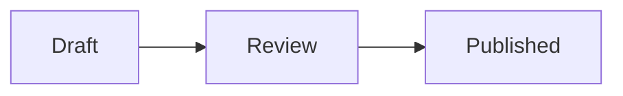

# Notebook Markdown

Every construct that Notebooks renders, with one compact example each. Read this page before you write note content, and write only what it lists. For the CLI workflow, start with [Notebooks CLI](index.md).

## Contents

- [Basics](#basics)
- [Text](#text)
- [Links, tags, and attachments](#links-tags-and-attachments)
- [Lists and tasks](#lists-and-tasks)
- [Tables and formulas](#tables-and-formulas)
- [Callouts](#callouts)
- [Code, diagrams, and math](#code-diagrams-and-math)
- [Named blocks](#named-blocks)
- [Data blocks](#data-blocks)
- [Contents and queries](#contents-and-queries)
- [Complete example](#complete-example)

## Basics

A note is GitHub-flavored Markdown; a single line break stays a line break. Book, the editor, and the PDF export all render this source. `cat` always returns that source, never rendered values such as formula results.

The first `# Heading` is the note title. Use `##` and deeper levels for sections. A heading needs a space after the `#`; `#word` is a tag.

## Text

| Write | Shows |
| --- | --- |
| `**bold**`, `*italic*`, `~~old~~` | bold, italic, strikethrough |
| `` `code` `` | inline code |
| `==marked==` | highlighted text |
| `H~2~O`, `x^2^` | subscript, superscript |
| `$a^2 + b^2$` | inline math (KaTeX) |
| `> quoted text` | a quote |
| `---` after a blank line | a horizontal rule |

Two `$` signs on one line become math. Write an amount as `\$5`, which Book and the PDF show as `$5`; the editor ignores the backslash, so write `5 USD` when a line holds two amounts. Raw HTML is shown as text. Footnotes and GitHub alerts (`> [!WARNING]`) are not supported; use a [callout](#callouts) instead. The reader shows `->` as `→` and `!=` as `≠` without changing the source; write `\->` to keep the characters.

## Links, tags, and attachments

```markdown
[Cloud docs](https://example.com/docs)
[Backup runbook](note://Ab12Cd)
[Restore steps](note://Ab12Cd#restore)

#projects #kickoff/q4


[Offer.pdf](attach://Pq56Rs)
```

- **Note links** use the six-character note ID from `ls`, `search`, or `cat --json`. Add a heading's slug after `#` to open the note at that heading: `#restore` for "Restore", `#backup-restore` for "Backup & Restore". A heading the note does not have opens the note at its top.
- **Tags** start with `#` and an ASCII letter, followed by ASCII letters, digits, `_`, or `-`; `/` nests them. Write them at the start of a line or after a space. They are stored in lowercase. Any other character ends the tag: `#prüfung` becomes `#pr`, so write `#pruefung`. Tags inside inline code and backtick code fences are ignored; a `~~~` fence or an indented code block still tags the note. Tags come only from the content; `write` has no tag option.
- **Attachments** come from `cld notebooks attach <note> <file>`, which prints the Markdown to paste. Images render inline, other files as links; the PDF export shows an image only as its label. `=400x`, `=x300`, or `=400x300` after the address sets the image size. External `https://` images render, too.

There are no mentions of people and no embedded notes. Typing `[[` in the editor only opens a picker that inserts a `note://` link.

## Lists and tasks

```markdown
1. Prepare the agenda
2. Book the room
   - Nested below item 2

- [ ] Send the invitations
- [x] Reserve the room
  - [ ] Test the projector
```

Indent a nested item to the text of its parent item: two spaces below `- `, three below `1. `. Tasks are plain checkboxes, with no due date, assignee, or priority. Write such facts into the item text or a table. Name the list to edit it later without touching the rest of the note; see [Named blocks](#named-blocks).

## Tables and formulas

```markdown
| Item | Price | Quantity | Total |
| --- | ---: | ---: | ---: |
| Hosting | 20 | 3 | =Price * Quantity |
| Domain | 12 | 1 | =Price * Quantity |
| Sum | | | =SUM(Total) |
```

`:---`, `:---:`, and `---:` align a column. A cell that starts with `=` is a formula; read [Table formulas](formulas.md) before you write one. Other cells accept bold, italic, strikethrough, inline code, links, and tags. Keep math, highlights, and images out of cells: the editor shows their source, and a cell that starts with `==` is a broken formula there. A cell holding only an ISO timestamp, such as `2026-10-12T09:00:00Z`, is shown in the reader's locale.

## Callouts

```markdown
:::warning
**Budget open:** approve it before the kickoff, or we move the date.
:::
```

```markdown
:::danger Before deleting
Export the notebook first. Deleting it cannot be undone.
:::
```

The types are `note`, `info`, `success`, `warning`, and `danger`. The opening line holds `:::`, the type, and an optional plain-text title, such as `:::danger Before deleting`; the title is the visible heading. Without a title, a callout shows its type through color only, so start the text with a bold label when readers need one. Close it with `:::` on its own line, indented no more than the opening line. Callouts follow the same rules in every Cloud app that renders Markdown, such as Spaces descriptions and comments.

Book renders full Markdown inside a callout, but the editor preview shows only bold, italic, inline code, and line breaks. Keep callouts to short text and put lists or tables after them.

## Code, diagrams, and math

````markdown
```bash
cld notebooks pull Docs ~/docs-mirror
```



$$
E = mc^2
$$
````

A language name after the opening fence highlights code. A `mermaid` fence renders a diagram in the editor and in Book; the PDF export shows its source. `$$ … $$` or a `math` fence renders display math.

## Named blocks

```markdown
@agenda
- [ ] Welcome
- [ ] Goals
```

Put `@name` on its own line directly above a table, a list, a `:::data` block, or a heading. A name starts with an ASCII letter and has at most 64 letters, digits, `_`, or `-`. A named heading covers its section up to the next heading of the same or a higher level. Above anything else, such as a callout or a paragraph, the handle has the type `unknown`, appears as text, and covers only the next line: `cat --block` returns nothing, and `--replace-block` replaces just that line, which breaks a callout. Do not edit such a block; name the surrounding section instead. Use names with `cat --block` and `edit --replace-block`; see [Named blocks](index.md#named-blocks) in the CLI reference.

## Data blocks

```markdown
@project
:::data
status: planned
owner: Ada
kickoff: 2026-10-12
budget: 12000
approved: false
teams:
  - operations
  - support
:::
```

Values are text, numbers, `true` or `false`, or flat lists with two spaces before each `-`. Quote text that would read as a number or boolean, such as `"42"` or `"true"`. Text that starts with `[`, `]`, `{`, `}`, `&`, `*`, `!`, `|`, `>`, `@`, or a backtick must be quoted, such as `"@ada"`, or the block is invalid. Values show as plain text, without links or formatting. Dates stay text: queries match them with `eq`, `in`, or `starts-with` (`2026-10`), not with `gt` or `lt`. Book shows the block as a card of keys and values. The complete rules are in [Declarative summaries](index.md#declarative-summaries).

## Contents and queries

```markdown
:::toc
min-depth: 2
max-depth: 3
:::

:::query
source: notes
scope: children
where:
  - field: project.status
    op: eq
    value: planned
columns:
  - $title
  - project.owner
:::
```

`:::toc` lists the headings of this note. `:::query` lists notes of the same notebook as links or, with `columns`, as a table. Settings and operators are in [Declarative summaries](index.md#declarative-summaries). Write callouts, `:::data`, `:::query`, and `:::toc` at the top level, not inside lists, quotes, or code.

## Complete example

````markdown
# Kickoff checklist

#projects #kickoff

:::toc
min-depth: 2
max-depth: 2
:::

## Goal

A shared understanding of scope, roles, and the first milestones.

@kickoff
:::data
status: planned
owner: Ada
date: 2026-10-12
:::

:::warning
**Budget open:** approve budget and scope before the kickoff, or we move the date.
:::

## Dates

@dates
| Milestone | Date | Owner | Days left |
| --- | --- | --- | ---: |
| Preparation done | 2026-10-08 | Ada | =DATEDIFF(TODAY(), Date, "d") |
| Kickoff | 2026-10-12 | Ada | =DATEDIFF(TODAY(), Date, "d") |

## Open tasks

@tasks
- [ ] Send the agenda
- [ ] Book the room and the video link
````

`write` replaces a note that already exists at its address, so first confirm with `cld notebooks stat "<notebook>:Kickoff checklist"` that no note is there. Write it with `cld notebooks write "<notebook>:Kickoff checklist" --from kickoff.md --json`, then read it back with `cat --json`: `blocks` lists `kickoff` (data), `dates` (table), and `tasks` (list). `preview` checks only the query and contents blocks; callouts, data values, and formulas are not validated, so follow the rules on this page exactly.
